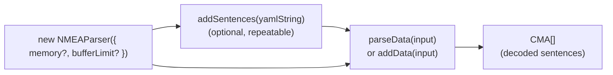
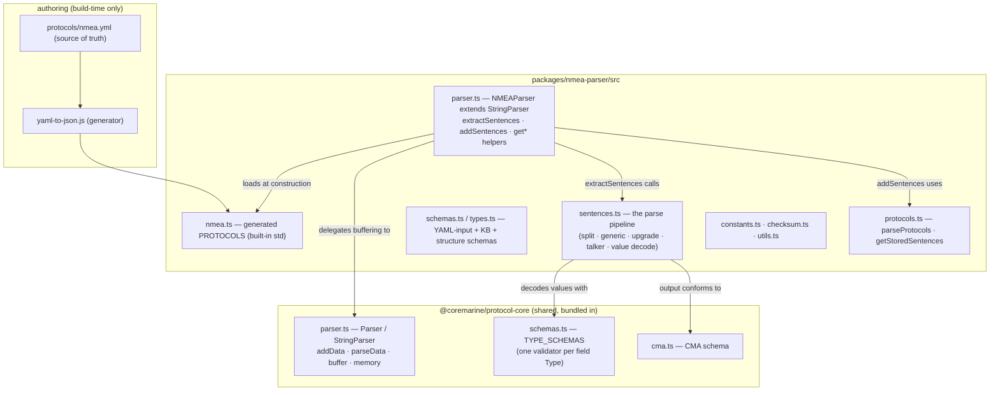
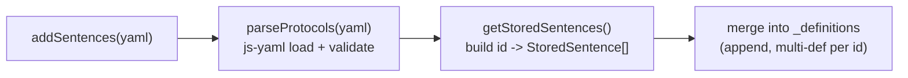
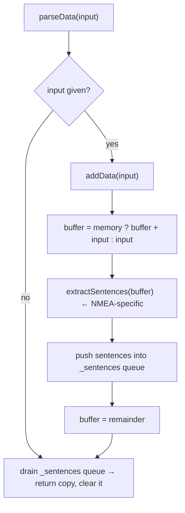
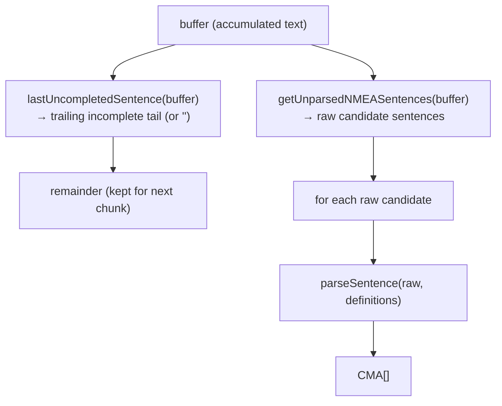
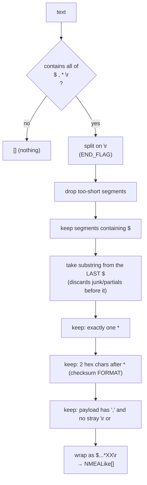
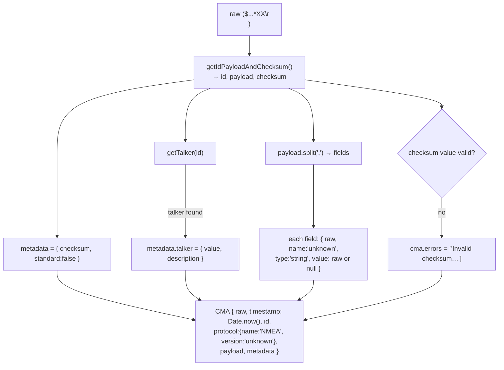
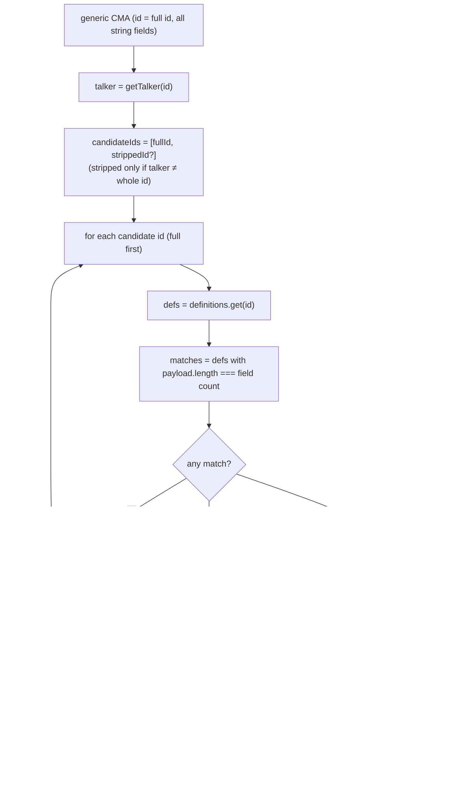
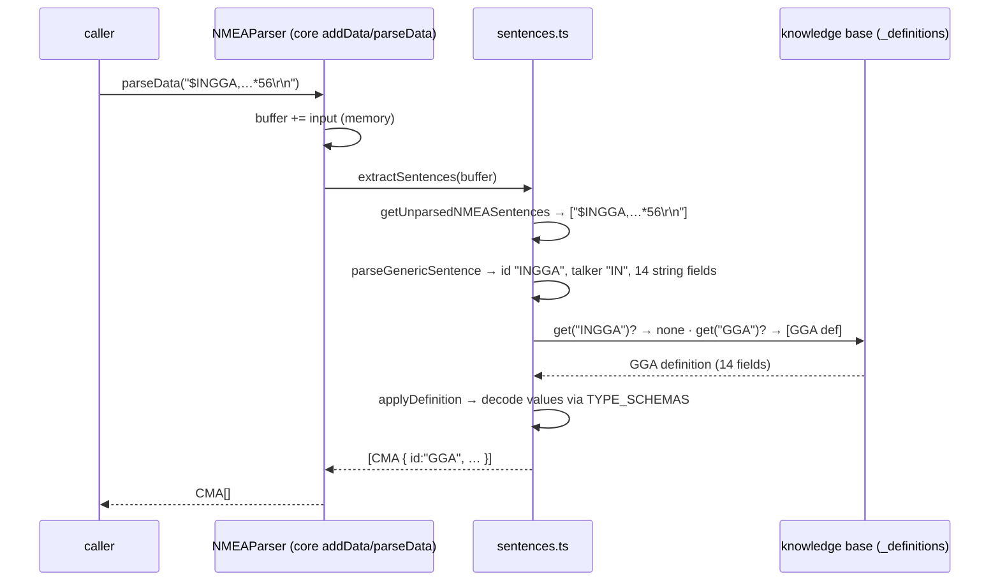

898# nmea-parser — the journey (how it works after the CMA refactor)

> **Why this doc exists.** The CMA refactor (2026-07-10) rewrote nmea-parser's `src/` onto the
> shared `@coremarine/protocol-core` base. This is the map: how you *use* the parser (developer
> journey) and, at each step, **where the code goes** (the internal path). nmea-parser is the
> reference implementation — the other four parsers will follow the same shape.
>
> Everything here reflects the **current committed-or-working code**, including the 3 metadata
> levels (STEP 1) and the no-throw Result pattern (STEP 2), both done 2026-07-10. The §Planned
> section at the end points at the next work: cloning this reference implementation to the other
> four parsers.

---

## 1. Mental model (one paragraph)

You create a `NMEAParser`. It comes pre-loaded with the built-in NMEA-0183 standard sentences
(its **knowledge base**). You can teach it more sentences by feeding a **protocols YAML string**
(`addSentences`). Then you push **raw text** at it (`parseData` / `addData`); it buffers, splits
the stream into candidate sentences, decodes each into the unified **CMA** shape — first as a
*generic* (unknown) sentence, then *upgraded* if the knowledge base recognises its id — and hands
you back `CMA[]`. The protocol-agnostic machinery (buffering, memory, the output queue) lives in
the shared core; nmea-parser only supplies the NMEA-specific "cut the buffer into sentences" step.

---

## 2. Developer journey (the happy path)



```ts
import { NMEAParser } from '@coremarine/nmea-parser'

const parser = new NMEAParser()                 // 1. create (built-in NMEA std pre-loaded)
parser.addSentences(await file.text())          // 2. (optional) teach it extra protocols
const sentences = parser.parseData(rawChunk)    // 3. feed raw text  ->  4. get CMA[]
```

- **`memory` defaults to `true`** (inherited from the core base): incomplete tails are kept and
  re-joined with the next chunk. Pass `{ memory: false }` for stateless one-shot parsing.

---

## 3. Where everything lives



**Key idea:** the core owns `addData`/`parseData`/buffer/memory. The *only* NMEA-specific method is
`extractSentences(buffer)` — "given the current buffer, return the complete `CMA[]` and the leftover
`remainder`." Everything protocol-specific hangs off that.

---

## 4. Step by step (with the code path)

### Step 1 — Create the parser

```ts
const parser = new NMEAParser({ memory: true })
```

`NMEAParser` constructor (`src/parser.ts`):
1. `super(options)` → the core `Parser` sets `memory`, `bufferLimit`, empties the buffer.
2. `registerProtocols(ProtocolsFileContentSchema.parse(PROTOCOLS))` → loads the built-in standard
   from the generated `src/nmea.ts` into the **knowledge base**.

The knowledge base is `this._definitions: Map<id, StoredSentence[]>` — **an array per id**, because
the same id can have several definitions (different field counts across NMEA versions).

### Step 2 — Feed the knowledge (YAML string)

```ts
parser.addSentences(yamlString)   // e.g. norsub.yml contents
```



- `parseProtocols` (`src/protocols.ts`): `yaml.load` → validate with `ProtocolsFileContentSchema`.
  **Web-safe** — it takes the file's *text*, never a path (no `node:fs`).
- `getStoredSentences`: flattens each protocol's sentences into `Map<id, StoredSentence[]>`,
  **appending** so multiple definitions accumulate under one id.

### Step 3 — Add input / parse

```ts
const out = parser.parseData(rawText)   // or: parser.addData(rawText)
```

`parseData` and `addData` are **the core's** (`protocol-core/src/parser.ts`) — identical for every
protocol:



### Step 4 — Read the output

`parseData` returns `CMA[]` — the decoded sentences that were completed by this (and any buffered
prior) input. Incomplete trailing bytes stay in the buffer for next time (when `memory` is on).

---

## 5. Deep dive — the NMEA pipeline (`extractSentences`)

This is the heart. `NMEAParser.extractSentences(buffer)`:

```ts
const remainder = lastUncompletedSentence(buffer) ?? ''
const sentences = getUnparsedNMEASentences(buffer).map((raw) => parseSentence(raw, this._definitions))
return { sentences, remainder }
```



### 5a. Cutting the stream — `getUnparsedNMEASentences` (`src/sentences.ts`)

Extracts every **structurally well-formed** candidate. Note: a bad *checksum value* is **not**
dropped here — it becomes an error on the emitted sentence (locked decision "never drop").



### 5b. Decode one candidate — `parseSentence`

```ts
parseSentence = (raw, defs) => upgradeKnownSentence(parseGenericSentence(raw), defs)
```

**Always parse generic first, then upgrade if recognised.**

#### `parseGenericSentence(raw)` — build an unknown-but-valid CMA



- `getTalker(id)` (`src/sentences.ts`): `≤3 chars` → no talker; a unique 2-char prefix in `TALKERS`
  → that talker; `U#` (U + digit) → user-configured; `P…` → proprietary (**the whole id is the
  talker**); otherwise `null`.
- Empty field (`,,`) → `value: null` ("present but empty").
- **Checksum & talker are sentence-level → they live in `cma.metadata`.** ✅ (This is the current
  behaviour and matches what you asked for.)

#### `upgradeKnownSentence(generic, definitions)` — recognise & decode



- **Lookup order = full id, then talker-stripped id.** The *matched* definition's id becomes the
  CMA `id`; the talker stays in `metadata`. This is what makes `HEHDT` resolve to GYROCOMPAS1
  (not standard `HDT`) and proprietary `PNORSUB8` resolve as a whole. *(This talker/id rule was an
  implementation call where the spec was silent — see STATUS §NMEA refactor.)*
- **Value decode** — `parseValue(raw, type)` (`src/sentences.ts`) validates against the core
  `TYPE_SCHEMAS[type]`: numerics via `Number()` + range check; `int64`/`uint64` kept as **decimal
  strings**; `boolean` from `true/false/1/0`; empty → `null`; anything that fails its type → `null`.

### 5c. Sequence view (feeding `$INGGA,…*56\r\n`)



---

## 6. The output shape (CMA)

```jsonc
{
  "raw": "$INGGA,132247.95,7118.690092,N,...,1006*56\r\n",
  "timestamp": 1720600000000,          // Date.now() at parse time (epoch ms)
  "id": "GGA",                         // matched id (talker removed)
  "protocol": { "name": "NMEA", "version": "3.1" },
  "payload": [
    { "raw": "132247.95", "name": "utc_position", "type": "string", "value": "132247.95", "units": "ms" },
    { "raw": "7118.690092", "name": "latitude", "type": "string", "value": "7118.690092", "units": "deg" },
    { "raw": "2", "name": "gps_quality", "type": "int8", "value": 2, "description": "…" },
    { "raw": "12", "name": "satellites", "type": "uint8", "value": 12 }
    // …14 fields total
  ],
  "metadata": {
    "checksum": "56",
    "standard": true,
    "talker": { "value": "IN", "description": "Integrated Navigation" }
  },
  "description": "Global Positioning System Fix Data"
}
```

Unknown sentences look the same but `protocol.version` is `"unknown"`, every field is
`type:"string"` with `name:"unknown"`, and `metadata.standard` is `false`.

---

## 7. Knowledge base cheat-sheet

- `_definitions: Map<id, StoredSentence[]>` — many definitions per id.
- Fed by: the built-in generated `PROTOCOLS` (at construction) + any `addSentences(yaml)` calls
  (appended).
- On a parse, a candidate matches a definition **only if the field count is equal**; among
  equal-count matches the **newest version wins** (`newestDefinition` / `compareVersions`).
- Inspect it with the nice-to-have helpers: `getSentences()`, `getSentencesByProtocol()`,
  `getSentence(id)`, `getFakeSentenceByID(id)`.

---

## Three metadata levels (STEP 1 — DONE 2026-07-10)

- **Sentence** `cma.metadata` → `checksum` (always) + `talker` (optional). ✅
- **Field** `cma.payload[i].metadata` → single-field derived metadata (decode a primitive into a
  richer form / unit conversion). Known sentences only. ✅
- **Payload** `cma.metadata.payload` (flat) → derivations needing ≥2 fields (e.g. GGA
  latitude/longitude in decimal degrees). Known sentences only. ✅

Field + payload metadata are produced by **dev-authored aggregators** (`src/metadata.ts`), keyed by
**`${id}:${payloadLength}`** (the stable identity — NOT field names), reading fields **by index**:

```ts
type MetadataAggregator = (sentence: CMA) => {
  fields?: Record<number, Metadata>   // field INDEX -> metadata → merged into payload[index].metadata
  payload?: Metadata                  // flat            → merged into cma.metadata.payload
}
// registry METADATA_AGGREGATORS keyed by `${id}:${payloadLength}`; aggregateMetadata(cma) runs
// after upgrade, no-ops when no aggregator is registered (unknown/wrong-length sentences untouched).
```

Pipeline is now `parseSentence = aggregateMetadata(upgradeKnownSentence(parseGenericSentence(raw)))`.
Metadata is free-form (`Record<string, unknown>`); core CMA schema unchanged. Seeded aggregator:
**GGA (`GGA:14`)** — field metadata `utc_position`→`{ timestamp }` (epoch ms, idx 0) and
`gps_quality`→`{ label }` (idx 5); payload metadata `{ latitude, longitude }` in decimal degrees
(idx 1+2, 3+4). This resurrects the deleted `nmea-metadata.ts` on the CMA shape.

## Result pattern (STEP 2 — DONE 2026-07-10)

`Result<T,E> = { success: true, value: T } | { success: false, error: E }` lives in
`@coremarine/protocol-core` (bare literals, no `ok`/`err` helpers). The knowledge-feed functions no
longer throw:

- `parseProtocols(yaml): Result<ProtocolsFileContent, NMEAError>` — `yaml.load` wrapped in try/catch
  (→ `kind: 'invalid-yaml'`); a `safeParse` miss → `kind: 'invalid-schema'`.
- `NMEAParser.addSentences(yaml): Result<void, NMEAError>` — non-string input or a failing
  `parseProtocols` come back as an error; on success the definitions are registered and it returns
  `{ success: true, value: undefined }`.
- The constructor loads the **trusted** bundled built-in with `safeParse` (never throws; on the
  impossible validation miss it registers nothing).

`NMEAError = { kind: 'invalid-yaml' | 'invalid-schema', message: string }` (in `src/types.ts`). The
parse hot-path already never throws (bad value → `null`; bad checksum → `errors[]`) and is unchanged.

## Planned (next parsers)

Clone the reference implementation to the other four parsers — **norsub-emru first** (it no longer
builds; it still uses the removed old NMEA API). Shared core exports to reuse:
`Parser`/`StringParser`/`BinaryParser`, `CMA`/`CMASchema`, `TYPE_SCHEMAS`, `Input`, `Result`.
